# MVBA Architecture Investigation


## 1. Starting Point (August 2025)

The original MVBA architecture was a single forward pass: 

- a CNN feature extractor (with positional encoding) produced a feature map 
- three iterations of slot attention competed over those features to assign each pixel to one of `n_slots` 
- an alpha generator produced per-slot sharpening parameters 
- spatial binding and feature binding operated once on the converged slots 
- and a per-slot decoder reconstructed the image 

The decoder outputted four channels per slot: three RGB and one mask. Slot masks were softmaxed across slots and used as weights to combine per-slot reconstructions into the final image. The training loss was reconstruction MSE only.

```python
# MVBA_start_state
decoder_layers.append(nn.Conv2d(current_channels, in_channels + 1, kernel_size=3, padding=1))

# MVBA_start_state
slot_decoded = self.spatial_decoder(slot_features)      # (B, C+1, H, W)
slot_recon = slot_decoded[:, :C]                        # RGB channels
slot_mask  = slot_decoded[:, C:C+1]                     # Mask channel
masks = torch.stack(masks, dim=1).squeeze(2)
masks = F.softmax(masks, dim=1)                         # softmax across slots
```

Trained under this regime, MVBA reconstructed images plausibly, but slot assignments were diffuse: no object cleanly mapped to a single slot. Here I got the suspicion that the model was learning to reproduce pixels, not to bind objects.

*Slot assignments for full model (trained on recon loss only)*
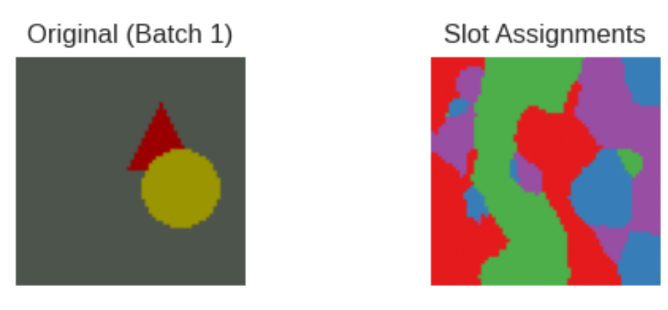


*Slots assignments for MVBA_spatial (trained on recon loss only)*
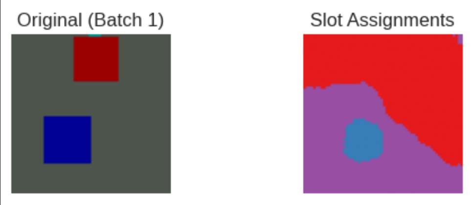

---

## 2. Adding Entropy Loss

To reward decisive per-pixel slot assignments, a Shannon entropy term was added to the loss. At every pixel, the slot-assignment mask is a probability distribution over slots; the entropy term penalises uniformity and rewards a single slot dominating each pixel:

`L_entropy = − Σ_s masks_s · log(masks_s + ε)` summed over slots, averaged over batch and pixels. Weight: 0.05.

```python
entropy = -(masks * torch.log(masks + eps)).sum(dim=1).mean()
```

The total loss becomes `L = L_recon + 0.05 · L_entropy`.

Under this loss, the spatial variant (which has spatial binding but no feature binding) produced better slot assignments. The full variant (which has both spatial and feature binding) failed differently: from early in training a single slot claimed most of the image, and this collapse persisted unchanged across 150 epochs.

*Spatial variant with entropy loss at epoch 40.*
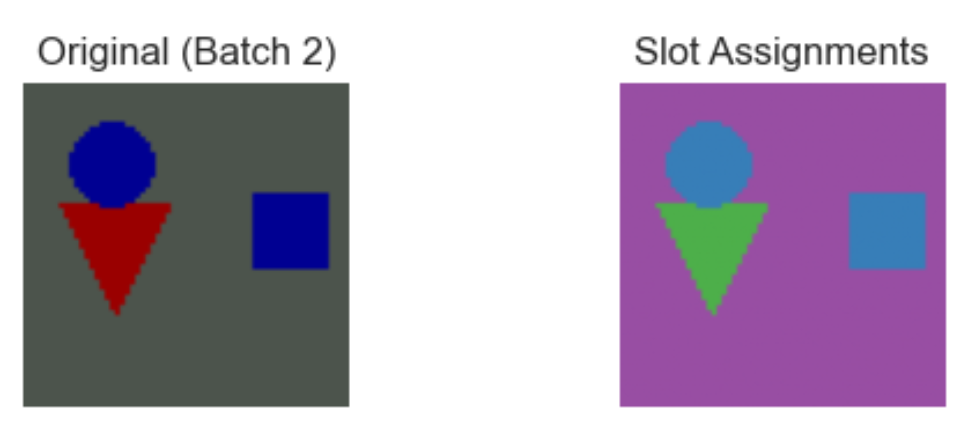

*Spatial variant with entropy loss at epoch 60.*
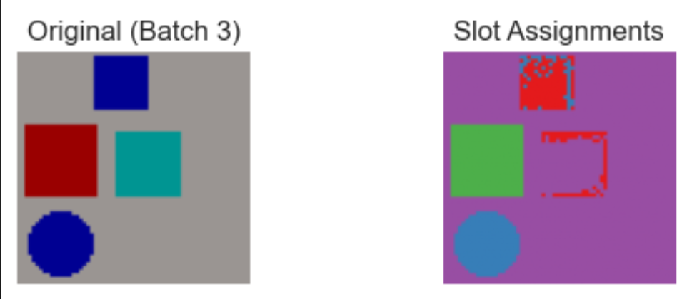

*Full variant with entropy loss at epoch 10. A single slot already dominates most of the image.*
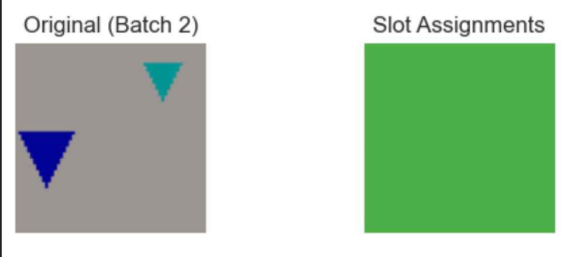

*Full variant with entropy loss at epoch 150. The single-slot collapse persists across the entire training run.*
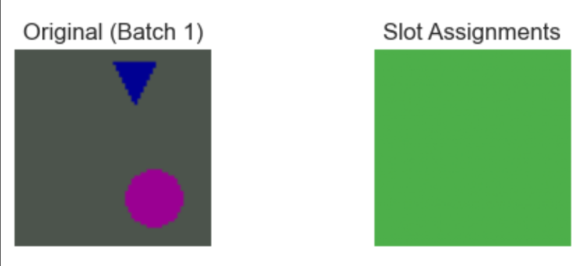

*Reconstruction comparison*
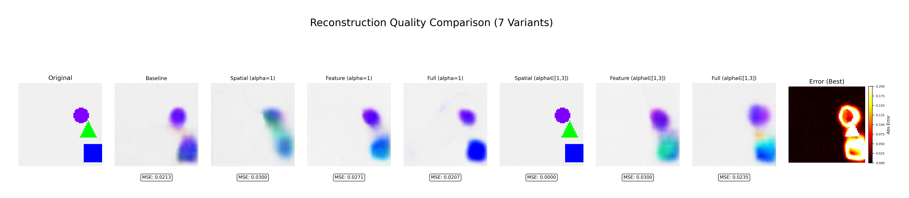

---

## 3. Diagnosing the Failure

There was an asymmetry: the architecturally simpler spatial variant outperformed the full variant, which had strictly more binding machinery. The diagnosis isolated the cause to gradient routing.

The `masks` tensor passed to the entropy loss differed by variant. For the spatial variant, `masks` was wired to be `spatial_attention` (the output of the spatial binding module). For the full variant, `masks` was the softmax of the decoder's mask-output channel independent of spatial binding.

The decoder's mask channel is a separate output, completely disconnected from the spatial binding module's parameters:

```python
# MVBA_start_state
slot_recon = slot_decoded[:, :C]      # RGB channels
slot_mask  = slot_decoded[:, C:C+1]   # Mask channel
masks = F.softmax(masks, dim=1)       # softmax across slots
```

The consequence is that for the full variant, the entropy gradient propagated back through the decoder's mask channel and stopped there. Spatial binding never received an entropy signal during training.

Direct measurement on trained checkpoints confirms this. The diagnostic computed per-pixel entropy of `masks` (what the loss saw) and of `spatial_attention` (what the spatial binding module produced) for each variant, with `n_slots = 4`:

| Variant | H(masks) | H(spatial_attention) | Δ |
|---|---|---|---|
| spatial | 0.115 | 0.115 | 0.000 -- aligned |
| full    | 6.5e-5 | **1.374** (max log(4) ≈ 1.386) | **1.374 -- catastrophic misalignment** |

For the full variant, the decoder masks had collapsed to near-one-hot (entropy ~ 0) while spatial_attention sat at near-maximum entropy (uniform). The entropy loss had been driving the decoder mask channel to decisiveness for the entire training run, while the spatial binding module (the one actually expected to do the WHERE-binding) remained at uniform output. The mechanism the loss was supposed to train was disconnected from the loss's gradient.

This also affected feature binding. Feature binding reduced inter-slot variance in the bound features by 95%, suggesting feature binding was destructive on its own. But feature binding pools features under spatial_attention, and spatial_attention in the full variant sat at H = 1.374 (near-uniform). Feature binding was propagating an upstream signal that had never been trained. The 95% homogenisation was a downstream consequence of the gradient-routing failure, not a property of the feature-binding operation itself.

---

## 4. The Fix: Unified Masking

A single change addressed the routing failure. The decoder was reduced from four channels per slot to three (RGB only). The mask channel was eliminated. Throughout the forward pass, `masks = spatial_attention`. Reconstruction was now a per-pixel convex combination of per-slot RGB outputs weighted by spatial attention.

```python
# MVBA_current_state
decoder_layers.append(nn.Conv2d(current_channels, in_channels,
                                kernel_size=3, padding=1))

# MVBA_current_state
masks = spatial_attention  # (B, n_slots, H, W)
```

With this change, the entropy loss differentiates through spatial binding directly. There are no competing decoder masks. The reconstruction gradient is no longer diluted through the decoder mask channel. Trained under the same recon+entropy0.05 loss as before, the full variant's FG-ARI rose from 0.038 to 0.803 on SimpleObjects.

*Full model after (masks = spatial attention) instead of (masks = decoder masks) trained on recon+0.05entropy*
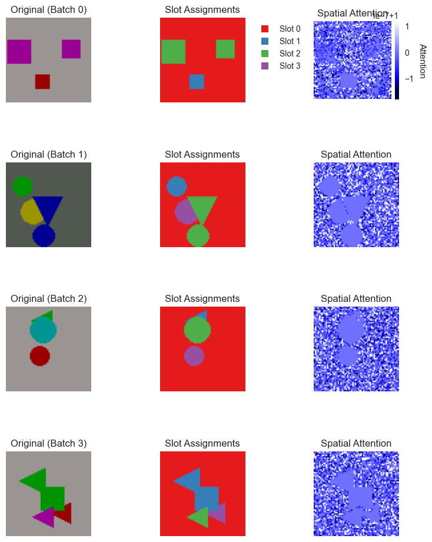

*Reconstruction comparison across variants under recon+0.05entropy and masks = spatial attention*
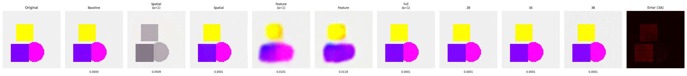

---

## 5. Recurrent BBRE Architecture

In the single-pass architecture, slot attention ran iteratively to convergence, and only then did the binding modules (alpha + spatial + feature) operate once, post-hoc. By the time spatial and feature binding saw the slots, those slots had been shaped exclusively by soft cross-attention. Feature binding was operating on a representation that BBRE (alpha gain modulation) had played no part in constructing.

The recurrent variant places the alpha and binding modules inside the Slot Attention loop. Each iteration re-computes alpha from the current slot state, runs spatial binding, runs feature binding, and updates the slots through the same GRU and MLP that slot attention uses. The standard slot-attention cross-attention is replaced by spatial binding inside this loop; the GRU and MLP retain their roles as the slot-update mechanism. Default `n_iters = 4`.

```python
def _bbre_step(self, slots, features, B):
    alphas = self.alpha_generator(slots)
    spatial_attn = self.spatial_binding(slots, features, alphas)
    bound, _ = self.feature_binding(features, spatial_attn, alphas, slots)
    slots_flat = slots.reshape(B * self.n_slots, self.slot_dim)
    bound_flat = bound.reshape(B * self.n_slots, self.slot_dim)
    slots = self.gru(bound_flat, slots_flat).reshape(B, self.n_slots, self.slot_dim)
    slots = slots + self.mlp(self.norm_post(slots))
    return slots, spatial_attn, bound
```

```python
for _ in range(self.n_bbre_iters):
    slots, spatial_attn, bound_features = self._bbre_step(slots, features, B)
```

Unified masking is preserved: the decoder still emits RGB only, and `masks = spatial_attention` from the final iteration. Trained under the entropy-only loss with `n_slots = 6`, this recurrent design reached FG-ARI 0.838 (prev single-pass 0.803) on SimpleObjects.

---

## 6. Evaluation Suite

Seven evaluation suites were run on the entropy-trained checkpoints, all on the SimpleObjects test split (n = 2000, batch size 16, random seed 42). 
- The Recon Quality Ablation produced the headline FG-ARI / MSE / PSNR / SSIM table across nine variants: `recurrent_full_fixed`, `recurrent_3A`, `recurrent_3B`, `full_unified_2B`, `recurrent_baseline`, `recurrent_spatial`, `recurrent_spatial_fixed`, `recurrent_feature`, and `recurrent_feature_fixed`.
- The Nonlinearity Comparison repeated the same evaluation across four gain functions and seven architectures (`recurrent_baseline`, `recurrent_spatial`, `recurrent_spatial_fixed`, `recurrent_feature`, `recurrent_feature_fixed`, `recurrent_full_fixed`, `recurrent_3A`). The four gain functions:
  - `power_law`: `f(x) = sign(x) · |x|^α`, with α ∈ [1, 3] learned per slot
  - `reynolds_heeger`: `f(x) = sign(x) · |g·x|^n` with n = 2 fixed and g ∈ [1, 3] learned per slot (divisive gain control)
  - `temperature`: `f(x) = τ · x` with τ ∈ [1, 3] learned per slot (linear scaling)
  - `sigmoid_gate`: `f(x) = x · σ(w·x + b)` with w, b learned per slot (data-dependent gating)

- The Alpha Analysis extracted per-iteration α distributions from the learned-α variants. 
- Property Prediction trained linear probes on slot vectors for color, shape, position, and size. 
- The slot-vector separability ablation measured inter-slot cosine dissimilarity. 
- The Slot Count Ablation swept `n_slots ∈ {4, 6, 8, 10}`. 
- Training Dynamics evaluated FG-ARI at intermediate checkpoints to characterise convergence speed. 
- A small CLEVR cross-dataset evaluation (1000 validation samples) was run on a subset of variants to test generalisation.

---

## 7. Key

### 7a. Architecture ablation

| Variant | FG-ARI |
|---|---|
| recurrent_full_fixed (α = 1) | 0.838 |
| recurrent_3A (learned α) | 0.838 |
| recurrent_3B (FIT two-stage) | 0.835 |
| full_unified_2B (single-pass) | 0.783 |
| recurrent_baseline (vanilla SA) | 0.722 |
| recurrent_spatial | 0.601 |
| recurrent_spatial_fixed | 0.394 |
| recurrent_feature | 0.0005 |
| recurrent_feature_fixed | 0.0005 |

 `recurrent_spatial_fixed` did not converge under entropy-only loss (training instability; loss stuck at 0.638 across 32 epochs). Excluded from observations below.

Learned α and fixed α = 1 tie at the top of the table. The recurrent MVBA architecture adds +0.116 FG-ARI over vanilla slot attention (recurrent_3A 0.838 minus recurrent_baseline 0.722) and +0.055 over single-pass MVBA architecture (recurrent_3A 0.838 minus full_unified_2B 0.783). Spatial binding alone reaches 0.601 while feature binding alone collapses to 0.0005. Feature binding contributes additively only when paired with spatial binding inside the recurrent loop.

### 7b. Nonlinearity comparison (3A subgroup)

| Nonlinearity | FG-ARI |
|---|---|
| power_law | 0.838 |
| reynolds_heeger | 0.833 |
| temperature | 0.816 |
| sigmoid_gate | 0.786 |

The four nonlinearities produce comparable binding quality. The specific gain function form does not drive the improvement.

### 7c. Alpha trajectory

Per-iteration mean spatial α (3A, power_law) over 500 samples × 6 slots:

| Iteration | α mean | α std |
|---|---|---|
| t = 0 | 1.806 | 0.523 |
| t = 1 | 1.801 | 0.576 |
| t = 2 | 1.802 | 0.547 |
| t = 3 | 1.811 | 0.522 |

The total drift across the four iterations is +0.005, essentially flat. Restricted to slot-object assignments where the slot maps to a real object (IoU ≥ 0.5), the final-iteration mean is α ≈ 2.26 (n = 1320 filtered assignments). The numbers in the table come from different averaging bases per-iteration over all 500 × 6 slot positions, the 2.26 over 1320 IoU-filtered assignments. Both show no progressive sharpening across iterations. The model learns a static α rather than a dynamic schedule.

### 7d. Property prediction

Color accuracy is binary across variants. Models with working feature binding (3A, recurrent_full_fixed, recurrent_3B, recurrent_baseline) reach color accuracy ≥ 0.99. Models without feature binding (full_unified_2B, recurrent_spatial) score 0.54–0.59. Position and size accuracy are uniformly strong across all non-collapsed variants. Feature binding enables WHAT encoding (color is intrinsically a feature property); spatial binding alone is sufficient for WHERE encoding (position emerges from slot-attention routing).

### 7e. CLEVR cross-dataset

| Variant | SimpleObjects FG-ARI | CLEVR FG-ARI |
|---|---|---|
| recurrent_full_fixed (α = 1) | 0.838 | 0.568 |
| recurrent_3A (learned α) | 0.838 | 0.005 |

Trained under entropy-only loss, evaluated on 1000 CLEVR6 validation images. The fixed-α variant transfers; the learned-α variant collapses. The alpha-learning mechanism that wins on synthetic data does not generalise.

*recurrent_full_fixed (α = 1) on CLEVR at epoch 125 -- slots cleanly assigned to distinct objects.*
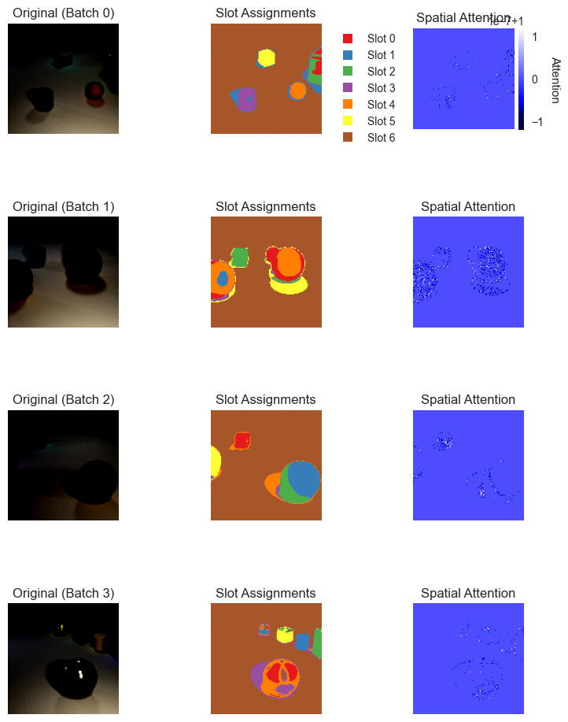

*recurrent_3A (learned α) on CLEVR at epoch 25 -- slot collapse; the alpha-learning mechanism does not transfer.*
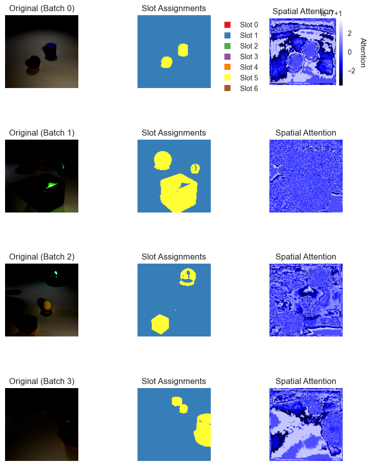

---

## 8. Assessment for NeurIPS

The learned gain parameter α (the BBRE-specific contribution) provides no measurable benefit over α = 1 (3A and full_fixed both at FG-ARI 0.838). The architectural improvements (dual-stream binding, unified masking, recurrent integration) produce a real +0.116 FG-ARI over vanilla slot attention, but these are standard attention-based modules, not novel contributions at the NeurIPS bar. The evaluation is primarily on a synthetic toy dataset (SimpleObjects) below the field's benchmark standard, and on CLEVR the flagship mechanism collapses (3A FG-ARI 0.005 vs full_fixed 0.568).

My research does not have a positive result on its central hypothesis (that BBRE-style learned gain modulation improves binding), and the architectural contributions are insufficient for a NeurIPS main conference submission.

---

## 9. Why Spiking Neural Networks Are the Right Next Step

The nonlinearity equivalence finding in ANNs has a clean explanation. In artificial neural networks, activations are continuous floats. Applying different gain functions to continuous values produces different floats, but the downstream softmax normalises them into probability distributions, and gradient descent adjusts upstream weights to compensate for whatever curve shape was chosen. The network routes around the nonlinearity. Given enough capacity and a correct gradient path, the specific function form is a reparameterisation that the optimiser absorbs.

Binding by enhanced firing rate is a hypothesis about neurons that communicate via discrete spikes, not continuous floats. Testing BBRE in an architecture where firing rates cannot be modelled, where there are no spikes, no refractory periods, no membrane dynamics, limits what the experiment can reveal about the hypothesis. The nonlinearity equivalence may be an artifact of the computational substrate, not evidence against BBRE.

In spiking neural networks, this absorption cannot happen, for three reasons.

First, information is temporal, not just magnitude. In ANNs, the value 0.7 is just the float 0.7. In SNNs, "0.7" might be represented as 7 spikes in a 10ms window (rate coding), or as a single spike at time 3ms within a 10ms window (temporal coding), or as a specific inter-spike interval. A power-law gain function applied to firing rates changes the rate to compresse or expand the dynamic range of spike counts. A temperature scaling changes the threshold, it modulates how much input current is needed to trigger a spike. These produce different spike trains, and the downstream neurons that receive those spike trains process them through their own membrane dynamics. The membrane potential integrates incoming spikes with an exponential decay kernel. This kernel is a temporal filter, not a pointwise function. Two different spike trains that would map to the same float in an ANN produce different membrane potential trajectories and therefore different downstream spike patterns.

Second, the spike function is non-differentiable. A neuron fires when its membrane potential crosses threshold; this is a step function. You cannot backpropagate through it directly. The field uses surrogate gradients. A surrogate gradient is a smooth approximations of the step function derivative during the backward pass. The choice of surrogate gradient (fast sigmoid, straight-through estimator, arctan, among others) interacts with the choice of gain function in ways that have no ANN analog. A power-law applied to a pre-synaptic signal changes the input current magnitude; the surrogate gradient determines how that change propagates backward. Different gain functions will interact with different surrogate gradients differently, potentially breaking the equivalence. This interaction does not exist in ANNs where backpropagation is exact.

Third, neurons have refractory periods and membrane time constants. After firing, a spiking neuron enters a refractory period where it cannot fire again, regardless of input. The membrane time constant determines how quickly the neuron forgets past input. These constraints impose hard limits on information flow that does not exist in ANNs. A gain function that pushes a neuron to fire very rapidly will hit the refractory ceiling (above a certain input gain, firing rate saturates). A gain function that spreads activation over time avoids this ceiling but sacrifices temporal precision. Power-law gain (strong amplification of strong signals) and temperature scaling (linear amplification of everything) will hit different biophysical ceilings at different points, producing genuinely different computational behaviours. In ANNs, there are no ceilings.

The Reynolds-Heeger variant becomes particularly interesting in this context. It separates learned gain (what attention does: modulate synaptic weights) from the fixed power-law exponent (what the neuron is: determined by membrane dynamics and ion channels). In ANNs this distinction was meaningless because both are learnable parameters on continuous floats. In SNNs it is the difference between modulating synaptic weights and changing ion channel density. This distinction maps directly onto the normalization model of attention.

If nonlinearity equivalence breaks in SNNs, then BBRE gains direct computational support in the substrate it was proposed for.
